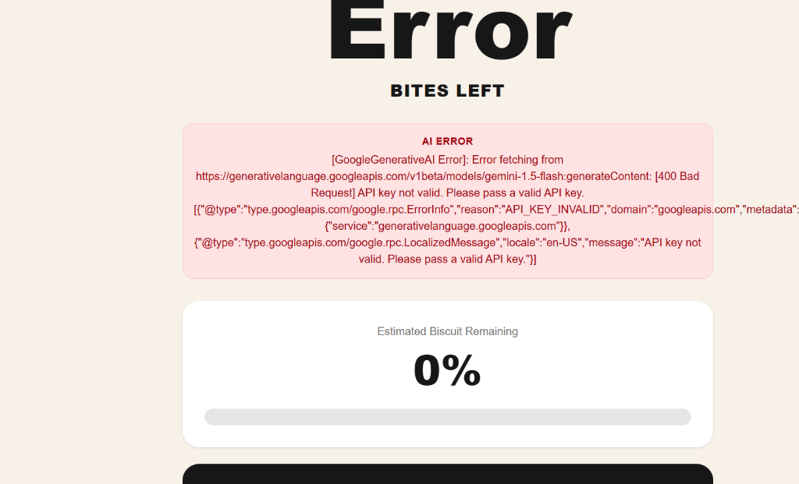
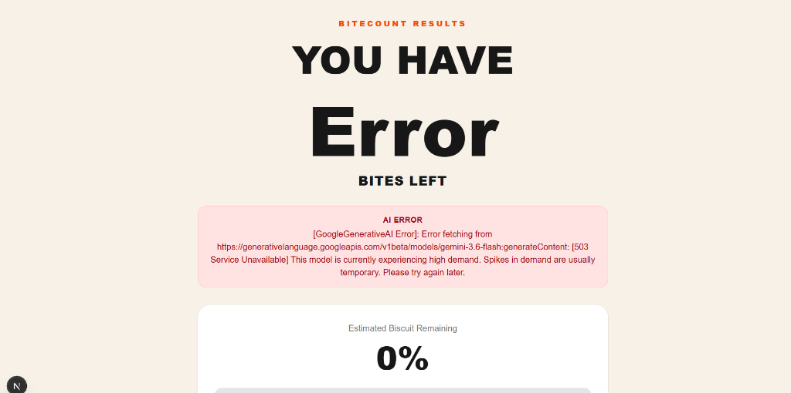
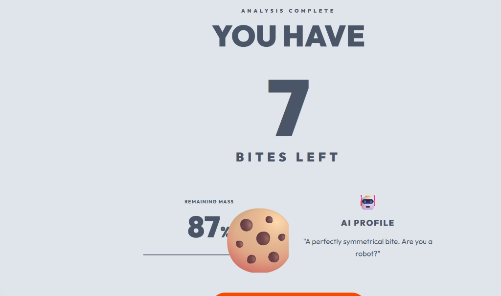

# Bitecount 🍪

## Basic Details
### Team Name: Buggies
### Team Members
- Team Lead: Ashwin M - College Of Engineering Vadakara
- Member 2: Ashwin M - College Of Engineering Vadakara
- Member 3: Abhinand Suresh SL - College Of Engineering Vadakara

### Project Description
An overly engineered AI application that analyzes a photo of a partially eaten biscuit to calculate exactly what percentage remains, how many bites are left, and judges your eating habits.

### The Problem (that doesn't exist)
People are constantly losing track of how much of their biscuit they have eaten, leading to a catastrophic lack of planning for their next bite.

### The Solution (that nobody asked for)
We built a Next.js application that uses Google's Gemini Vision AI (and a fallback Math Computer Vision algorithm) to mathematically dissect the remaining surface area of a biscuit and roast you for your eating habits.

## Technical Details
### Technologies/Components Used
For Software:
- TypeScript / JavaScript
- Next.js (React Framework)
- Tailwind CSS (Styling)
- Google Generative AI (Gemini 3.6+ Vision Models)
- HTML5 Canvas (Local Computer Vision Fallback)

### Implementation
For Software:
# Installation
```bash
npm install
```

# Run
```bash
npm run dev
```

### Project Documentation
For Software:

# Screenshots

*The Neumorphic landing page inviting the user to start the scan.*


*The scanning interface where users align the biscuit and take reference photos.*


*The final analysis dashboard showing the remaining percentage, bite count, and a snarky AI joke.*

# Architecture Diagram
The architecture relies on Next.js Server Actions calling the Gemini Vision API for analysis, with an instant failover to a client-side HTML5 Canvas pixel-comparison algorithm if the API rate-limits.

### Project Demo
# Video
*(Add your demo video link here)*

# Additional Demos
[Add any extra demo materials/links]


## Team Contributions
- Abhinand Suresh SL: Frontend & Camera Integration
- Ashwin M: AI Prompt Engineering, Fallback Logic, Documentation & Testing

---
Made with ❤️ at TinkerHub Useless Projects 


